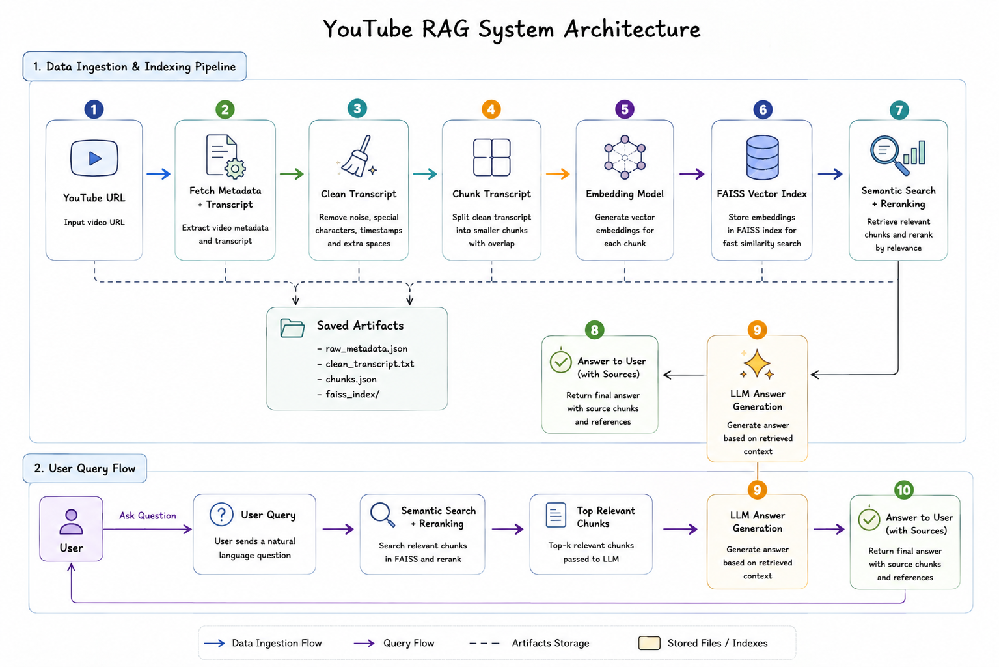
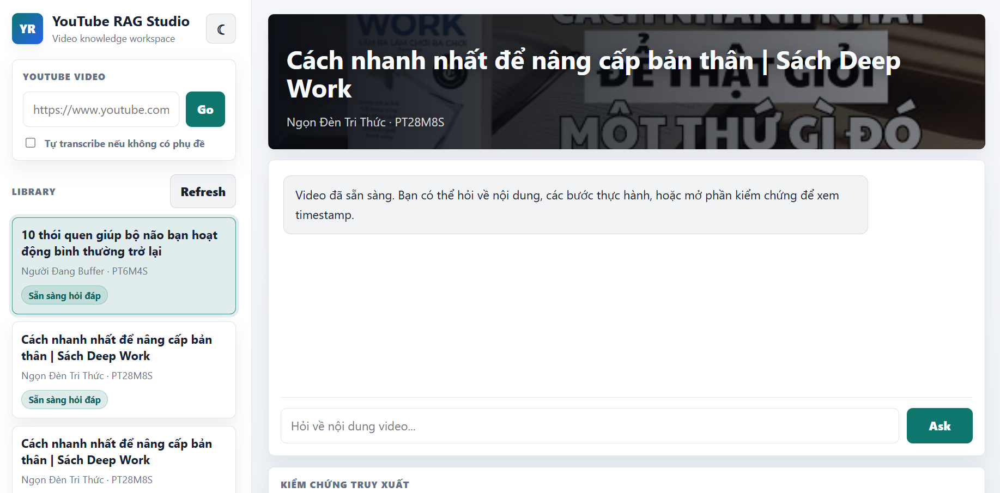

# YouTube RAG LLM


A local YouTube RAG application that extracts video metadata and transcripts, builds a vector knowledge base, and answers questions with retrieval-augmented generation using Gemini.

## Features

- Submit a YouTube URL from a local web interface.
- Fetch video metadata with the YouTube Data API.
- Download subtitles/transcripts with `yt-dlp`.
- Clean and chunk transcripts for retrieval.
- Generate embeddings with Sentence Transformers.
- Build a FAISS vector index for semantic search.
- Ask questions about each video using Gemini with retrieved transcript context.
- Keep chat history per video in the browser.
- Switch between light and dark themes.
- Use the CLI for scraping, indexing, local search, or LLM testing.

## Architecture



The system has two main flows:

- **Data ingestion and indexing**: YouTube URL -> metadata and transcript -> transcript cleaning -> chunking -> embeddings -> FAISS index -> saved local artifacts.
- **User query flow**: user question -> semantic search and reranking -> top transcript chunks -> Gemini answer generation -> final answer with sources.

## Project Structure

```text
.
├── web_app.py                 # Local web server and API routes
├── templates/
│   └── index.html             # Web UI markup
├── static/
│   ├── app.css                # Web UI styles
│   └── app.js                 # Frontend behavior
├── image/
│   └── architecture.png       # Architecture diagram used in this README
├── youtube_scraper/
│   ├── main.py                # CLI entry point
│   ├── metadata.py            # YouTube metadata fetching
│   ├── transcripts.py         # Transcript download and transcription fallback
│   ├── knowledge_base.py      # Embedding and FAISS index creation
│   ├── search.py              # Semantic search and reranking
│   ├── chatbot.py             # Gemini-based RAG answers
│   └── utils.py               # Helpers for cleaning, chunking, and exporting
├── requirements.txt
└── .gitignore
```

## Clone the Repository

```powershell
git clone https://github.com/ChiBao-v/Video-RAG-Assistant  
cd Video-RAG-Assistant
```

## Installation

Create and activate a virtual environment:

```powershell
python -m venv .venv
.\.venv\Scripts\activate
```

Install dependencies:

```powershell
pip install -r requirements.txt
```

## Environment Variables

Create a `.env` file in the project root or inside `youtube_scraper/.env`:

```env
YOUTUBE_API_KEY=your_youtube_api_key
GEMINI_API_KEY=your_gemini_api_key
GEMINI_MODEL=gemini-2.5-flash
```


## Run the Web App

```powershell
.\.venv\Scripts\python.exe web_app.py
```

Open the app at:

```text
http://127.0.0.1:8000
```

Paste a YouTube URL, wait for the transcript and vector index pipeline to finish, then ask questions about the video.

## Test the Web Interface

After starting the local web server, open:

```text
http://127.0.0.1:8000
```

Use the web UI to test the main workflow:

1. Paste a YouTube video URL.
2. Click `Go`.
3. Wait until the indexing job is completed.
4. Select the processed video from the library.
5. Ask a question in the chat box.
6. Open the retrieval panel to inspect source chunks and timestamps.

You can also switch between light and dark mode using the theme button in the sidebar.



## CLI Usage

Scrape a video and build the knowledge base:

```powershell
.\.venv\Scripts\python.exe -m youtube_scraper.main --video "https://www.youtube.com/watch?v=VIDEO_ID" --output "local/test_cli/test_cli.json" --langs "vi-orig,vi,vi-VN,en" --delay 5 --rag --knowledge-base
```

Ask with local retrieval/search:

```powershell
.\.venv\Scripts\python.exe -m youtube_scraper.main --ask "What is this video about?" --output "local/test_cli/test_cli.json"
```

Force an LLM answer with Gemini:

```powershell
.\.venv\Scripts\python.exe -m youtube_scraper.main --ask "What are the main ideas in this video?" --llm --output "local/test_cli/test_cli.json"
```

Use local transcription fallback when a video has no subtitles:

```powershell
.\.venv\Scripts\python.exe -m youtube_scraper.main --video "https://www.youtube.com/watch?v=VIDEO_ID" --output "local/test_cli/test_cli.json" --rag --knowledge-base --transcribe-missing
```

## Notes

- The first indexing or question-answering run may take time because embedding and reranking models need to load.
- `Loading weights...` is expected during model loading.
- Age-restricted or region-restricted videos may require cookies.
- `.env`, `.venv/`, `local/`, caches, logs, and generated indexes are ignored by `.gitignore`.
